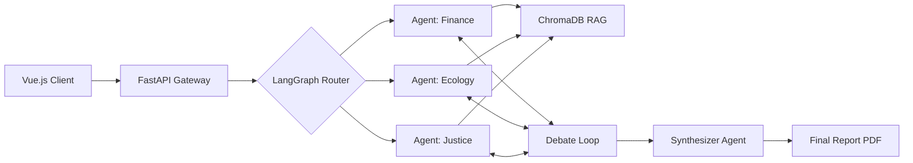

# Qurultai AI

### The Digital Council for Transparent Governance

---

## 📜 Executive Summary

**Qurultai** is a sovereign, multi-agent decision support platform designed to modernize public administration. Named after the ancient Turkic council of leaders, Qurultai simulates a "Digital Cabinet" where AI agents represent specific government ministries.

These agents analyze policy documents, detect conflicts between legal frameworks, and collaborate to generate consensus-based recommendations. It transforms the opaque, siloed process of government decision-making into a transparent, auditable, and efficient digital workflow.

## 🔥 The Problem

Government decision-making is plagued by **Institutional Fragmentation**:

- **Siloed Data:** Ministries operate independently; decisions by one often violate the regulations of another.
- **Opacity:** Citizens and businesses often cannot understand _why_ a decision was made or which laws apply.
- **Latency:** Inter-ministerial coordination is manual, paper-based, and slow.

## 💡 The Solution

Qurultai introduces an **Agentic Orchestration Layer** over government data.

1.  **Input:** A user (Citizen, Business, or Official) submits a query or document.
2.  **Council:** Specialized AI agents (Finance, Justice, Ecology) analyze the input against their specific legal knowledge bases.
3.  **Debate:** Agents identify conflicts and propose solutions in a transparent "Group Chat" format.
4.  **Consensus:** A Synthesizer agent compiles the debate into a structured, legally referenced PDF report.

## 🚀 Key Features

- **The Council Chamber:** A unique chat interface where users observe AI agents debating and collaborating in real-time.
- **Agent Orchestration Panel:** An admin dashboard to create, configure, and deploy specialized agents (e.g., assign "Tax Code" to the Finance Agent).
- **Sovereign RAG Engine:** Retrieval-Augmented Generation runs locally using Ollama, ensuring sensitive government data never leaves the infrastructure.
- **Explainable AI:** Every decision is traced back to specific articles in the law. No "Black Box" answers.
- **PDF Report Generation:** Automatic creation of official-style documents for government circulation.

## 🛠️ Tech Stack & Architecture

This project uses a modular, sovereignty-first architecture:

| Component         | Technology                                   |
| :---------------- | :------------------------------------------- |
| **Orchestration** | LangGraph (State Machine for Cyclic Debates) |
| **Frontend**      | Vue.js 3 + Vite + PrimeVue                   |
| **Backend**       | FastAPI (Python)                             |
| **Local LLM**     | Ollama (Llama 3 / Mistral)                   |
| **Vector Store**  | ChromaDB                                     |
| **Database**      | SQLite                                       |
| **Embeddings**    | Nomic Embed Text (via Ollama)                |

### Architecture Flow

## 🤝 Team

  <i>Qurultai: Where Tradition Meets Digital Intelligence.</i>

